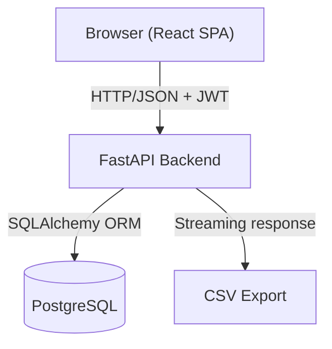
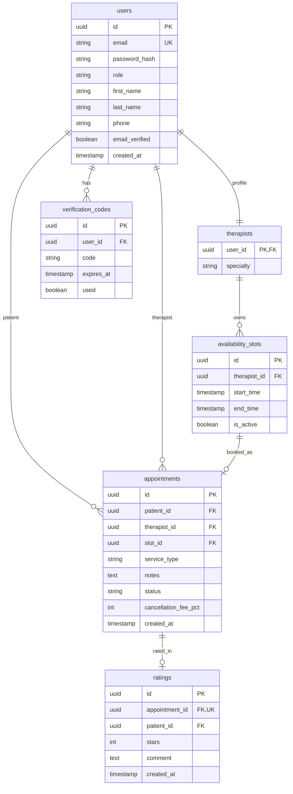

# Design Document — MORAD MVP

## Overview

MORAD es una SPA (Single Page Application) con un backend REST. El frontend React se comunica con la API FastAPI via HTTP/JSON. La autenticación usa JWT (access token de vida corta + refresh token). La base de datos es PostgreSQL en producción; SQLite es aceptable solo para desarrollo local rápido.

El flujo core que debe funcionar de punta a punta antes de cualquier pulido:

```
Registro → Login → Ver horarios → Reservar → Cancelar/Reprogramar → Calificar
```

---

## Architecture



### Estructura de directorios

```
morad/
├── backend/
│   ├── app/
│   │   ├── main.py               # App factory, routers, CORS
│   │   ├── config.py             # Settings via pydantic-settings
│   │   ├── database.py           # SQLAlchemy engine + session
│   │   ├── models/               # ORM models
│   │   ├── schemas/              # Pydantic schemas (request/response)
│   │   ├── routers/              # Route handlers por dominio
│   │   ├── services/             # Lógica de negocio
│   │   ├── dependencies.py       # get_current_user, require_role
│   │   └── seed.py               # Seed data
│   ├── alembic/                  # Migraciones
│   ├── requirements.txt
│   └── .env.example
└── frontend/
    ├── src/
    │   ├── api/                  # Axios client + hooks por dominio
    │   ├── components/           # UI components reutilizables
    │   ├── pages/                # Una carpeta por vista
    │   ├── hooks/                # React Query hooks
    │   ├── store/                # Auth state (Zustand o Context)
    │   ├── lib/                  # utils, cn(), constants
    │   └── main.tsx
    ├── tailwind.config.ts
    ├── package.json
    └── vite.config.ts
```

**Dependencias frontend principales:** `react`, `react-router-dom`, `@tanstack/react-query`, `react-hook-form`, `@hookform/resolvers`, `zod`, `zustand`, `axios`, `shadcn/ui`, `tailwindcss`, `lucide-react`

---

## Components and Interfaces

### Backend — Routers

| Router | Prefijo | Roles permitidos |
|---|---|---|
| `auth` | `/api/auth` | público |
| `users` | `/api/users` | autenticado |
| `slots` | `/api/slots` | patient (read), admin (write) |
| `appointments` | `/api/appointments` | patient, therapist, admin |
| `ratings` | `/api/ratings` | patient (write), admin (read) |
| `therapists` | `/api/therapists` | autenticado |
| `reports` | `/api/reports` | admin |
| `metrics` | `/api/metrics` | admin |

### Backend — Endpoints principales

**Auth**
```
POST /api/auth/register         → RegisterResponse
POST /api/auth/login            → TokenResponse
POST /api/auth/refresh          → TokenResponse
POST /api/auth/logout           → 204
```

**Slots**
```
GET  /api/slots?date=&therapist_id=   → List[SlotOut]
POST /api/slots                       → SlotOut          [admin]
PUT  /api/slots/{id}                  → SlotOut          [admin]
DELETE /api/slots/{id}                → 204              [admin]
```

**Appointments**
```
GET  /api/appointments                → List[AppointmentOut]  [patient: own | therapist: own | admin: all]
POST /api/appointments                → AppointmentOut        [patient]
POST /api/appointments/{id}/cancel   → AppointmentOut        [patient]
POST /api/appointments/{id}/reschedule → AppointmentOut      [patient]
GET  /api/appointments/{id}          → AppointmentOut
PATCH /api/appointments/{id}/status  → AppointmentOut        [therapist, admin]
```

**Ratings**
```
POST /api/ratings                     → RatingOut        [patient]
GET  /api/ratings?appointment_id=     → List[RatingOut]  [admin]
```

**Reports & Metrics**
```
GET /api/reports/appointments?from=&to=&therapist_id=&format=json|csv
GET /api/metrics/dashboard
```

### Frontend — Librerías de estado, formularios y fetching

| Librería | Uso |
|---|---|
| **TanStack Query** | Server state: fetching, caching, invalidación de queries tras mutaciones |
| **React Hook Form** | Manejo de formularios (registro, login, reserva, slots) |
| **Zod** | Esquemas de validación compartidos con React Hook Form via `zodResolver` |
| **Zustand** | Client state: sesión del usuario autenticado (tokens, perfil, rol) |

### Frontend — Páginas / Vistas

| Ruta | Vista | Rol |
|---|---|---|
| `/register` | Registro | público |
| `/login` | Login | público |
| `/appointments` | Mis citas | patient |
| `/book` | Reservar cita | patient |
| `/therapist/agenda` | Agenda del día | therapist |
| `/admin/slots` | Gestión horarios | admin |
| `/admin/reports` | Reportes | admin |
| `/admin/metrics` | Dashboard métricas | admin |

### Frontend — Componentes clave

- `SlotPicker` — calendario + lista de slots filtrables por terapeuta
- `AppointmentCard` — tarjeta con estado, acciones (cancelar, reprogramar, calificar)
- `RatingModal` — dialog con estrellitas + textarea
- `AppointmentDetailModal` — para el terapeuta, datos del paciente + historial
- `ScheduleWeekView` / `ScheduleMonthView` — para gestión de horarios admin
- `ReportTable` — tabla con filtros + botón CSV
- `MetricsDashboard` — cards con conteos y gráficas simples

---

## Data Models



### Notas de esquema críticas

- `appointments.status`: enum `confirmed | completed | cancelled | no_show`
- `availability_slots`: índice UNIQUE sobre `(therapist_id, start_time)` para bloquear solapamientos.
- `appointments`: restricción a nivel de BD para evitar doble reserva del mismo slot: UNIQUE sobre `(slot_id)` donde `status IN ('confirmed')`, o manejo con `SELECT ... FOR UPDATE` dentro de una transacción en el servicio de reserva.
- `cancellation_fee_pct` se calcula en el backend al momento de cancelar, según la política vigente y si es la primera cancelación del paciente.

---

## Error Handling

### Backend

Todos los errores usan `HTTPException` con un body consistente:

```json
{ "detail": "Mensaje legible para el usuario" }
```

| Situación | HTTP Status |
|---|---|
| Credenciales inválidas | 401 |
| Token expirado / inválido | 401 |
| Rol insuficiente | 403 |
| Recurso no encontrado | 404 |
| Regla de negocio violada (límite de citas, ya calificado, etc.) | 422 |
| Slot ya reservado (condición de carrera) | 409 |
| Validación de Pydantic | 422 |
| Error interno | 500 |

### Frontend

- Errores 4xx → toast con el campo `detail` del response.
- Errores 5xx → toast genérico "Ocurrió un error, intenta de nuevo".
- Errores de red → toast "Sin conexión".
- React Query maneja `isLoading` / `isError` states para mostrar skeletons y estados vacíos.

---

## Testing Strategy

### Backend

- **Unit tests** (pytest): servicios con lógica de negocio compleja — cálculo de fee de cancelación, validación de solapamiento de slots, límite de citas activas.
- **Integration tests** (pytest + httpx `TestClient`): endpoints principales del ciclo core (register → login → book → cancel → rate). Usar SQLite en memoria para tests.
- Fixtures compartidas en `conftest.py`: usuario paciente, terapeuta, admin, slot disponible.

### Frontend

- **Component tests** (Vitest + Testing Library): `SlotPicker`, `AppointmentCard`, `RatingModal`.
- **Happy-path flow**: reserva y cancelación usando mocks de la API (msw).
- No se requieren tests E2E (Cypress/Playwright) en el MVP.

### Seed data

Script `backend/app/seed.py` ejecutable via `python -m app.seed`:
- 1 admin, 2 terapeutas, 5 pacientes
- Slots para los próximos 30 días (mañana y tarde por terapeuta)
- Citas en todos los estados (`confirmed`, `completed`, `cancelled`, `no_show`)
- Al menos 2 ratings para probar el panel de admin

---

## Key Design Decisions

1. **Sin Redis en MVP**: las consultas de disponibilidad son directas a BD con índices. Si el rendimiento lo exige luego, se agrega caché sin cambiar contratos.
2. **Doble reserva**: se resuelve con una transacción `SELECT ... FOR UPDATE` en el servicio de reserva + un índice único como red de seguridad. Más simple que optimistic locking.
3. **Política de cancelación en backend**: el cálculo del fee vive en `CancellationService` para que sea testeable y no dependa del frontend.
4. **`email_verified = true` por defecto**: el campo existe en el modelo para activar verificación real sin migraciones en una fase posterior.
5. **Reprogramación atómica**: `RescheduleService` envuelve cancelación + nueva reserva en una sola transacción de BD.
6. **Métricas anonimizadas**: el endpoint `/api/metrics/dashboard` nunca retorna PII; agrupa por rangos de edad, tipo de servicio y estado.
